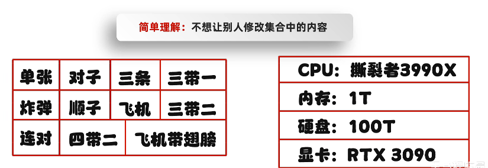
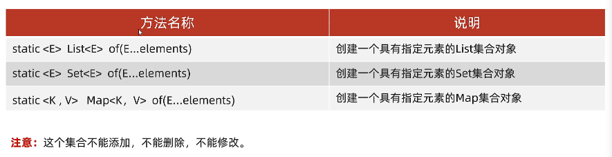
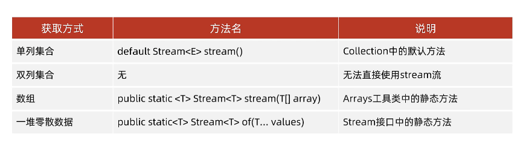
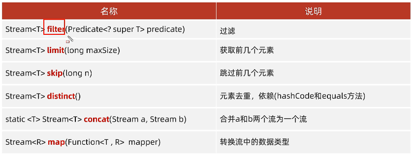
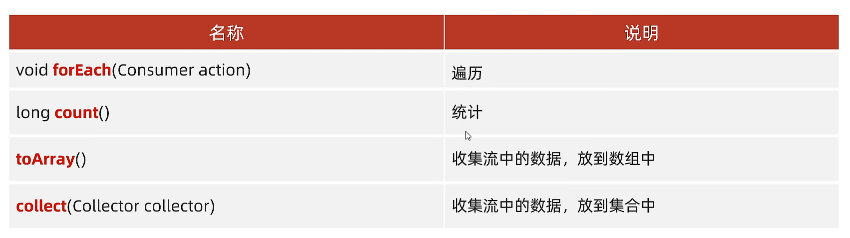

## 创建不可变集合的应用场景

+ 如果某个数据不能被修改，把它防御性地拷贝到不可变集合中是个很好的实践。
+ 当集合对象被不可信的库调用时，不可变形式是安全的

## 创建不可变集合的书写格式

+ 在List、Set、Map接口中，都存在静态的of方法，可以获取一个不可变的集合。

## Stream流

### Stream流的作用

结合了Lambda表达式，简化集合，数组的操作

### Stream流的使用步骤

1. 先得到一条Stream流（流水线），并把数据放上去
2. 利用Stream流中的API进行各种操作

### Stream流的中间方法

**注意1**:中间方法，返回新的Stream流，原来的Stream流只能使用一次，建议使用链式编程

**注意2**:修改Stream流中的数据，不会影响原来集合或者数组中的数据

### Stream流的终结方法

